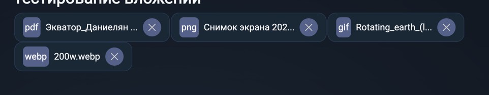
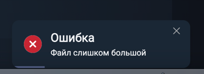
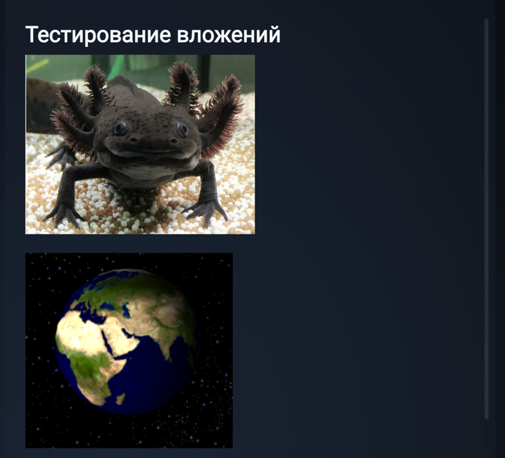
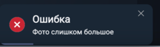
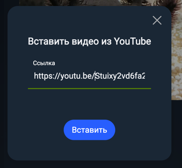
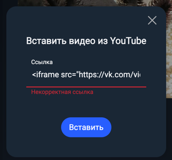
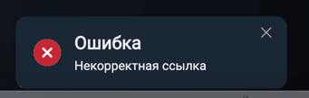

## Вложения

**Браузер** - _Google Chrome Version 128.0.6613.121

**Мобильная версия** - _Google Chrome Version 128.0.6613.128

### Файл:
- После открытия меню редактора и нажатия по иконке "Файл" открывается окно просмотра файлов на компьютере, файлы недопустимых (все кроме pdf, jpg, jpeg, png, gif, webp, mp4, mp3, wav) расширений при этом добавить невозможно
- При прикреплении файла видим на заметке иконку вложения с разрешением и названием файла, соответствующим названию файла на компьютере (справедливо для файлов всех допустимых типов:  pdf, jpg, jpeg, png, gif, webp,  mp4, mp3, wav):\

- При нажатии на иконку вложение скачивается на компьютер
- При нажатии на иконку удаления - вложение удаляется (**CAUTION:** чтобы удалить вложение необходимо нажать на самый центр иконки, иначе - файл скачивается)
- При попытке прикрепить файл размером больше допустимого (30Мб) появляется тост с ошибкой "Файл слишком большой":\

### Картинка:
- После открытия меню редактора и нажатия по иконке "Картинка" открывается окно просмотра файлов на компьютере, файлы недопустимых (все кроме jpg, jpeg, gif) расширений при этом добавить невозможно
- При прикреплении картинки, она отображается в заметке:\
  
- При нажатии BackSpace картинка удаляется (если каретка расположена после картинки)
- При попытке прикрепить картинку размером больше допустимого (30Мб) появляется тост с ошибкой "Фото слишком большое":\

### Видео:
- После открытия меню редактора и нажатия по иконке "Видео" открывается поп-ап с полем для ввода ссылки\

- При вводе ссылки на видео в YouTube в заметке появляется окно для просмотра видео
- При вводе любого текста, отличного от ссылки на YouTube появляется сообщение "Некорректная ссылка":\

- При попытке вставить некорректную ссылку (любой текст кроме ссылки на видео в YouTube) появляется тост с ошибкой "Некорректная ссылка":\

- При нажатии BackSpace видео удаляется (если каретка расположена после фрейма с видео)
