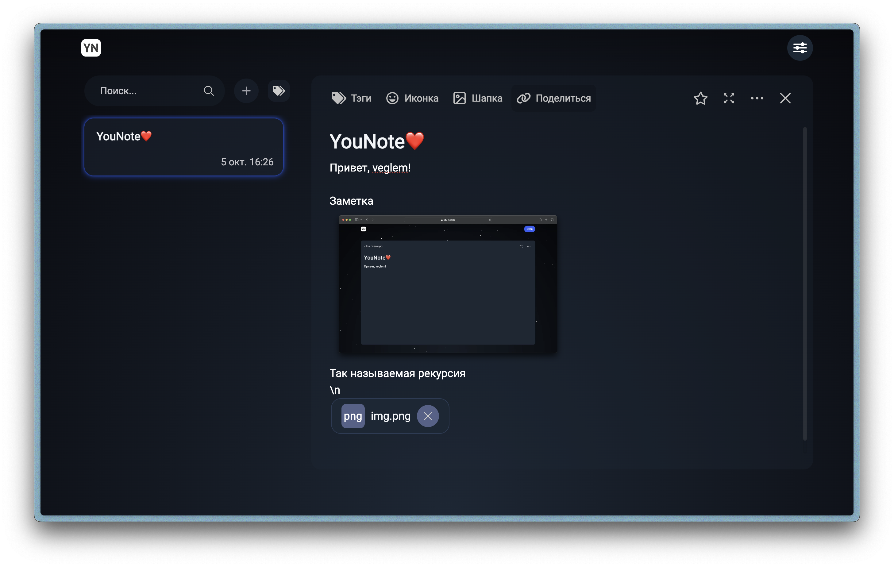
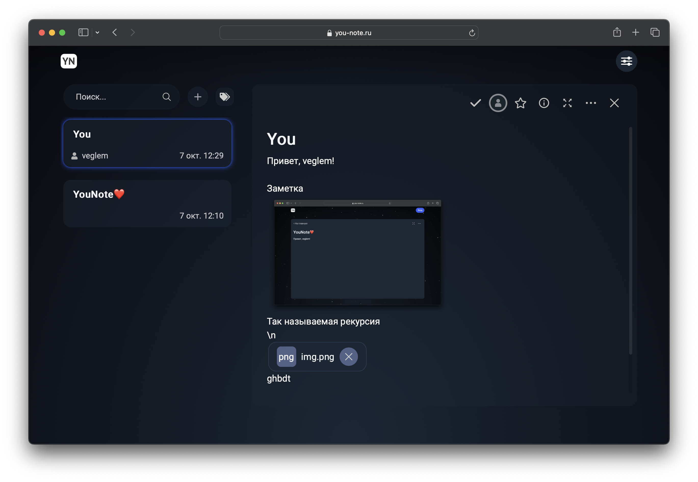

# Совместное редактирование
____
## Владелец заметки

## Функционал

* Приглашение пользователя по логину
* Отображение пользователей, редактирующих заметку
* Синхронизация изменений в заметке, сделанных всеми пользователями 

### Приглашение

Для приглашения пользователя надо нажать кнопку "Поделиться", далее ввести логин пользователя, которого хотите пригласить в поле "Введите логин" и нажать кнопку "Отправить".
После этого отобразится уведомление "Успех. Приглашение успешно отправлено".

### Отображение пользователей, редактирующих заметку

В правом верхнем углу заметки отбражается аватарка пользователя, который в данный момент редактирует заметку, при наведении на аватар будет отображено имя пользователя.

### Синхронизация

Все изменения, сделанные дркгими пользователями будут синхронизированны и отображены у всех пользователей, просматривающих эту заметку.

## Верстка

Верстка адаптируется под размер экрана пользователя, превращая окно приглашения в popup виджет

## Приглашенный пользователь

## Функционал

* Отображение пользователей, редактирующих заметку
* Синхронизация изменений в заметке, сделанных всеми пользователями 
* Приглашенный пользователь не может удалить заметку

Функционал и верска у приглашенного пользователя аналогична, за исключением того, что приглашенный пользователь не может удалить чужую заметку, не может приглашать других пользователей в эту заметку, а так же под заголовком заметки у него отображается имя владельца этой заметки.

