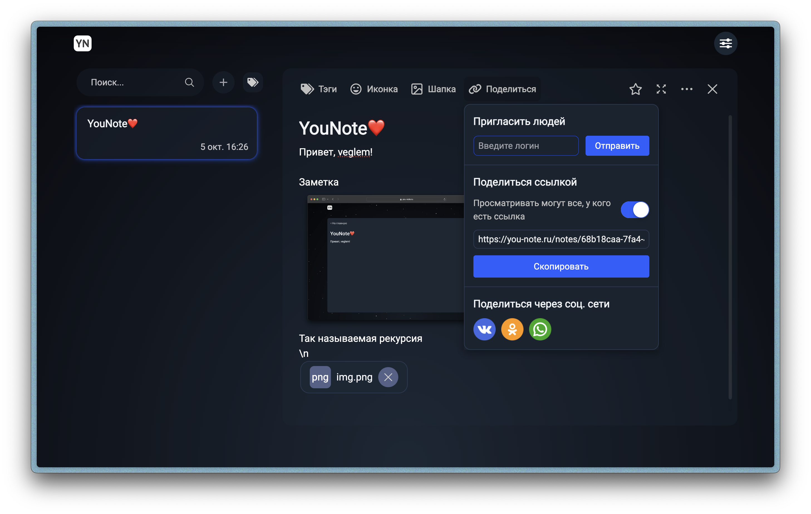
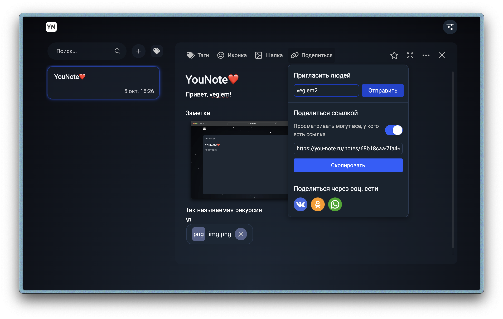
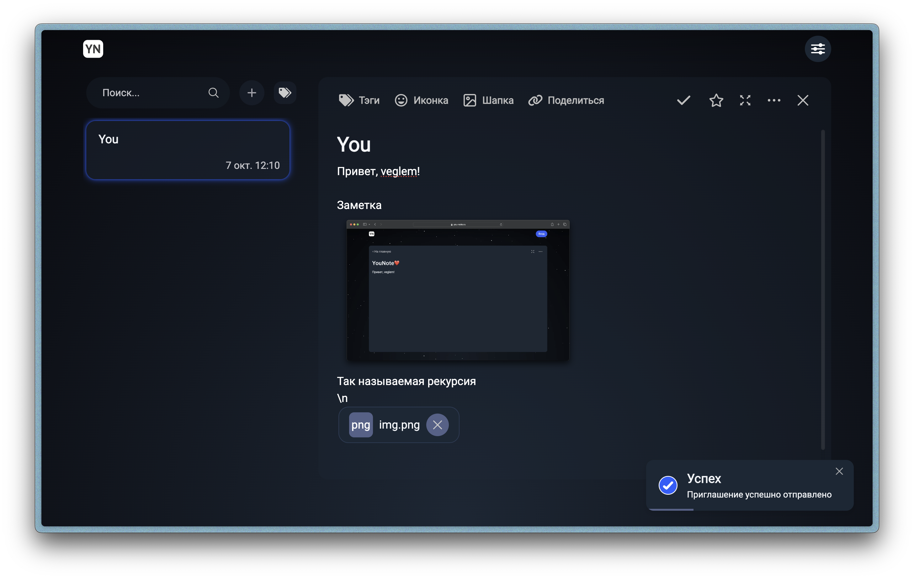
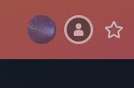
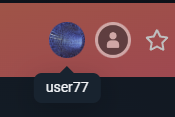
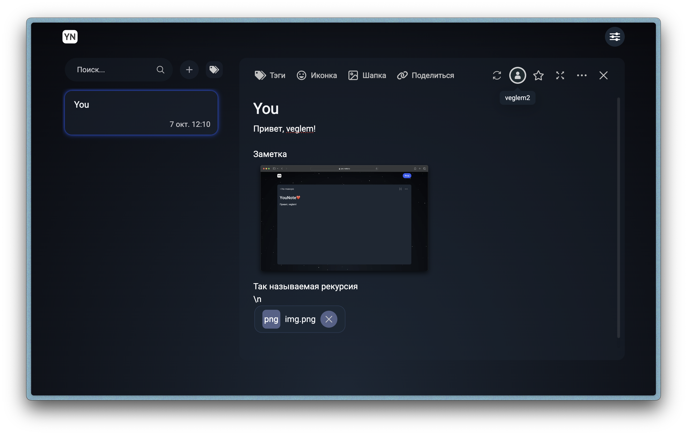
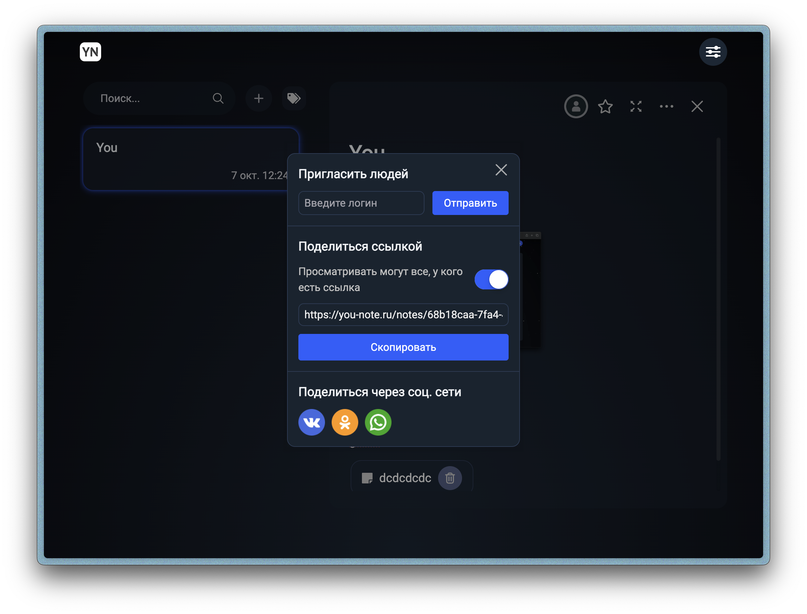
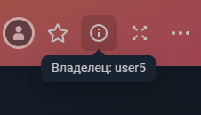

# Совместное редактирование
____
## Владелец заметки

## Функционал

* Приглашение пользователя по логину
* Отображение пользователей, редактирующих заметку
* Синхронизация изменений в заметке, сделанных всеми пользователями 

### Приглашение

* При нажатии на кнопку "Поделиться" в тулбаре редактора заметки открывается панель для шэринга заметки
  * При нажатии на кнопку "Отправить"
    * Если инпут логина пуст
      * Ничего не просходит
    * Если введен логин владельца заметки
      * Инпут логина не очищается
      * Отображается тост "Инфо. Вы не можете пригласить самого себя"
    * Если введен логин существующего пользователя
      * Инпут логина очищается
      * Пользователю отправляется приглашение
      * Отображается тост "Успех. Приглашение успешно отправлено"
    * Если введен несуществующий логин
      * Инпут логина очищается
      * Отображается тост "Ошибка. Пользователь не найден"

### Отображение пользователей, редактирующих заметку

* При открытии заметки в тулбаре редактора отображаются аватарки пользователей, которые в данный момент редактируют заметку

    
* При наведении на аватар пользователя - отображается его логин

    
* Когда пользователь закрывается заметку - его аватарка перестает отображаться в тулбаре у остальных пользователей, редактирующих заметку

### Синхронизация

Все изменения, сделанные дркгими пользователями будут синхронизированны и отображены у всех пользователей, просматривающих эту заметку.

## Верстка

Верстка адаптируется под размер экрана пользователя, превращая окно приглашения в popup виджет

## Приглашенный пользователь

## Функционал

* Доступ к редактированию заметки
* Синхронизация изменений в заметке, сделанных всеми пользователями 
* Нет возможности удалить заметку

## Вертска

* В тулбаре появляется пункт, при наведении на который отображается имя владельца заметки

