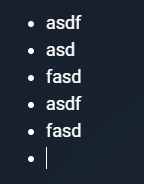

# Редактор

**Браузер** - _Google Chrome Version 128.0.6613.138_

**Мобильная версия** - _Google Chrome Version 15.5.58.28.arm64_

## Тулбар

### Функционал

* При нажатии на пункт "Тэги" отображается меню для изменения тэгов заметки
* При нажатии на пункт "Иконка" отображается меню для изменения иконки заметки
* При нажатии на пункт "Шапка" отображается меню для изменения шапки заметки
* При нажатии на пункт "Поделиться" отображается меню шеринга заметки
  * Из меню шеринга заметки можно сделать заметку публичной, скопировать ее ссылку и поделиться ею в социальных сетях, а также пригласить других пользователей в заметку
* При нажатии на иконку "Избранного" заметка добавляется в избранное и закрепляется наверху в списке заметок
* При нажатии на иконку "Полноэкранного режима" редактор открывается в полноэкранном режиме
* Если пользователь находится в подзаметке, то отображается кнопка "Вернуться" при нажатии на которую открывается родительская заметка
* При нажатии на иконку "Троеточия" открывается выпадающий список
  * Пункт "Скачать в pdf" 
    * При нажатии скачивается заметка в формате pdf
  * Пункт "Скачать в zip"
    * При нажатии скачивается zip, содержащий заметку в формате pdf и все аттачами в формате webp
  * Пункт "Удалить заметку"
    * При нажатии появляется модальное окно для подтверждения удаления заметки
      * При нажатии на кнопку "Удалить"
        * Модальное окно скрывается
        * Заметка удаляется
      * При нажатии на кнопку "Отменить"
        * Модальное окно скрывается
        * Заметка не удаляется
      * При нажатии в область вне модального окна
        * Модальное окно скрывается
        * Заметка не удаляется
* При нажатии на кнопку "Закрыть" происходит сохранение заметки и редактор закрывается

* **Bug** В разрешении 1560px и меньше, при наборе символов в тело заметки мерцают кнопки "На весь экран" и "Закрыть"
* **Bug** Избранные заметки нельзя удалить

### Верстка

* На мобильных устройствах содержимое тулбара прячется в выпадающее меню
  * Меню открывается по клику на кнопку с тремя точками
  * При клике вне меню - само меню скрывается
  * При клике по любому из пунктов меню - само меню скрывается

## Редактор заметки

### Функционал

* Сверху находится инпут для изменения название заметки
  * При отсутствии названия заметки отображается плэйсхолдер "Введите название"
* Снизу находится тектовое поле для редактирования тела заметки
  * При введении символа "/" появляется выпадающее меню для вставки специальных обьектов

  

    * Нажатие на пункт "Заголовок 1" превращает текущую строку в заголовок первого уровня
    * Нажатие на пункт "Заголовок 2" превращает текущую строку в заголовок второго уровня
    * Нажатие на пункт "Заголовок 3" превращает текущую строку в заголовок третьего уровня
    * Нажатие на пункт "Заголовок 4" превращает текущую строку в заголовок четвертого уровня
    * Нажатие на пункт "Заголовок 5" превращает текущую строку в заголовок пятого уровня
    * Нажатие на пункт "To-do список" создает To-do список
      * При нажатии на чекбокс - соответствующий пункт в списке отмечается галочкой и текст перечеркивается
      
      
  * Нажатие на пункт "Ненумерованный список" создает ненумерованный список

    
  * Нажатие на пункт "Нумерованный список" создает нумерованный список
  
    

  

* **Bug** После вставки заголовка любого уровня перестает открываться выпадающее меню

### Верстка

* Размер редактора адаптируется под размер экрана устройства
