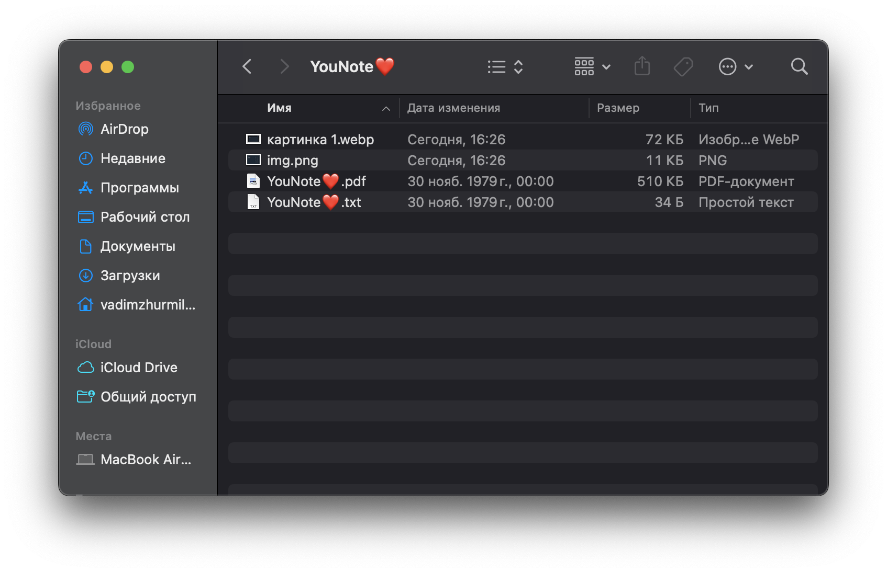

# Экспорт
___
## Функционал

* Экспорт в pdf
* Экспорт в zip

При экспроте в pdf экспортируется только текст и изображения

При экспорте в zip экспортируется отдельно pdf с текстом заметки и изображении и отдельными файлами все вложения

