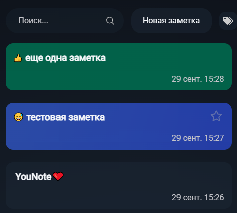
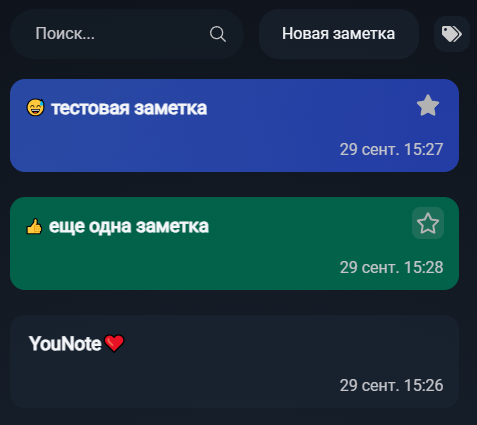
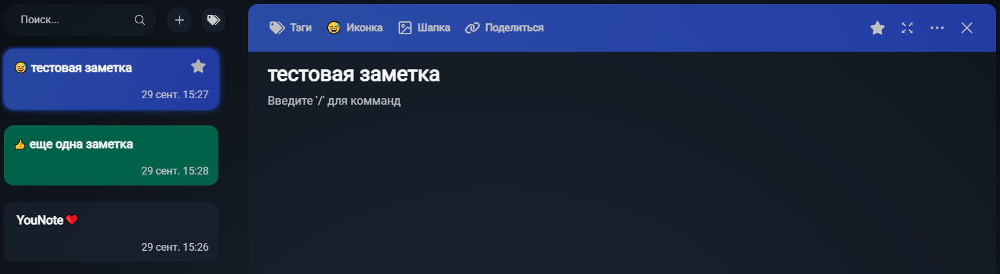

# Избранное

## Главная

* При наведении курсора на заметку, на ней появляется звездочка. При переводе курсора с заметки в другое место, звездочка исчезает.

* При нажатии на появившуюся звездочку, звездочка становится закрашенной, то есть заметка добавляется в избранное. При этом заметка, добавленная в избранное, должна переместиться в списке выше всех не избранных заметок. Закрашенная звездочка отображается на заметке всегда.

* При нажатии на закрашенную звездочку, заметка удаляется из избранного, звездочка возвращается в исходное состояние.

## Редактор

* В шапке заметки отображается звездочка, причем она не закрашена если заметка не в избранном, и она закрашена если заметка в избранном.

* При добавлении заметки в избранное через редактор, закрашивается звездочка на главной, а заметка в списке должна оказаться выше всех не избранных заметок.

* При удалении заметки из избранного через редактор, пропадает звездочка на главной.

## Шаринг + избранное

* После приглашения пользователя в свою заметку по username добавить ее в избранное. Заметка корректно добавляется в избранное (появляется звездочка, заметка в списке поднимается выше всех не избранных). При этом у приглашенного пользователя заметка остается не в избранном.

*BUG:* У приглашенного пользователя пропадает заметка из списка.

* Добавить в избранное заметку, которая принадлежит другому пользователю, в которую приглашен текущий пользователь. Заметка корректно добавляется в избранное (появляется звездочка, заметка в списке поднимается выше всех не избранных). При этом у владельца заметка остается не в избранном.

*BUG:* У владельца пропадает заметка из списка.
