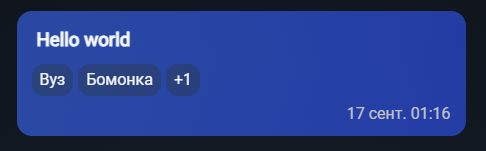
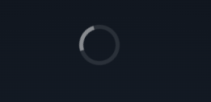
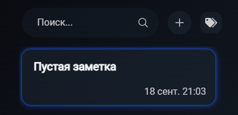
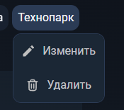

# Главная

**Браузер** - _Google Chrome Version 128.0.6613.138_

**Мобильная версия** - _Google Chrome Version 15.5.58.28.arm64_

## Список заметок

### Функционал

* Отображается список заметок пользователя

* При клике на заметку она открывается в редакторе
* При большом количестве заметок они подгружаются по 10 штук каждый раз когда пользователь доскролит до конца списка

### Верстка

* При большом количестве тэгов у заметки - они сокращаются
* При большом количестве заметок - появляется вертикальный скролл

## Поиск

### Функционал

* Заметки фильтруются по введенному в поле поиска значению
* В случае, когда заметки не были найдены - отображается надпись "Список заметок пуст"

### Верстка

* Во время поиска заметок отображается лоадер с анимацией

## Создание заметки

### Функционал

* При нажатии на кнопку "Добавить заметку" открывается редактор новой заметки. Сама же заметка появляется в списке

### Верстка

* Если редактор открыт, то текст у кнопки создания новой заметки заменяется на иконку "+"

## Тэги

### Функционал

* Есть возможность фильтровать заметки по тэгам (одному и более)
* При клике по тэгу правой мышкой открывается выпадающее меню редактирования тэга:
  * При выборе пункта "Изменить" откывается модальное окно с формой для обновления названия у тэга
  * При выборе пункта "Удалить" откывается модальное окно для подтверждения удаления тэга

### Верстка

* Список тэгов адаптируются под размер экрана