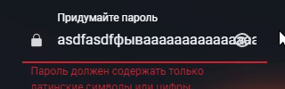

# Авторизация и регистрация

**Браузер** - _Google Chrome Version 128.0.6613.138_

**Мобильная версия** - _Google Chrome Version 15.5.58.28.arm64_

## Регистрация 

### Поле логина
- При заполнении латиницей или цифрами от 4 до 12 символов регистрация проходит успешно
- При заполнении слишком малым/большим количеством символов появляется соотвествующая ошибка
  - "Логин должен содержать только латинские символы или цифры"
- При заполнении смайликом появляется соотвествующая ошибка
- При заполнении кириллицей появляется соотвествующая ошибка

### Поле пароля и подтверждения пароля
- При заполнении валидным паролем ( латиницей не менее 8 символов и содержащим хотя бы одну 1 букву ) регистрация проходит успешно
- При несоотвествии полей пароля и повторения пароля появляется соотвествующая ошибка 
- При заполнении кириллицей появляется соотвествующая ошибка
- При заполнении пароля без букв появляется соотвествующая ошибка
- При заполнении слишком малым количеством символов (7 символов и меньше) появляется соотвествующая ошибка
- При попытке заполнения очень длинного пароля (20 символов и больше) поле пароля не увеличивается в размере
- При нажатии на глазок текст у поля прячется / отображается
- **Bug** При указании длинного пароля (20 символов и больше) и при нажатии на глазок текст накладывается на глазок

### Нажатие на кнопку "Зарегистрироваться"
- При вводе валидных данных происходит перенаправление на страницу с заметками
- При наличии в базе введенного логина выдается ошибка о том, что такой логин уже занят
- В случае неуспешного заполнения хотя бы одного из полей - выводится ошибка

 

## Авторизация

### Поле логина
- Аналогично полю логина из страницы регистрации

### Поле пароля
- Аналогично полю пароля из страницы регистрации

 

### Нажатие на кнопку "Войти"
- При вводе существующего логина и правильного пароля, при условии что у пользователя на аккаунте отключена двухфакторная аутентификация, происходит перенаправление на страницу с заметками
- При вводе существующего логина и правильного пароля, при условии что у пользователя на аккаунте включена двухфакторная аутентификация, появляется поле для ввода шестизначного OTP кода
- При вводе существующего логина и правильного пароля, а также правильного OTP кода, происходит перенаправление на страницу с заметками
- В случае неуспешного заполнения хотя бы одного из полей - выводится ошибка

## Интеграция
- На десктопе: при нажатии кнопки "Зарегистрироваться" происходит переход на форму регистрации
- На таче: при нажатии на надпись "Еще нет аккаунта?" происходит переход на форму регистрации
- На десктопе: При нажатии кнопки "Войти" происходит переход на форму авторизации
- На таче: При нажатии кнопки "Уже зарегистрированы?" происходит переход на форму авторизации

## Верстка
- Размер формы не изменяется при переключении между авторизацией и регистрацией
- Размер формы адаптируется под размер экрана устройства