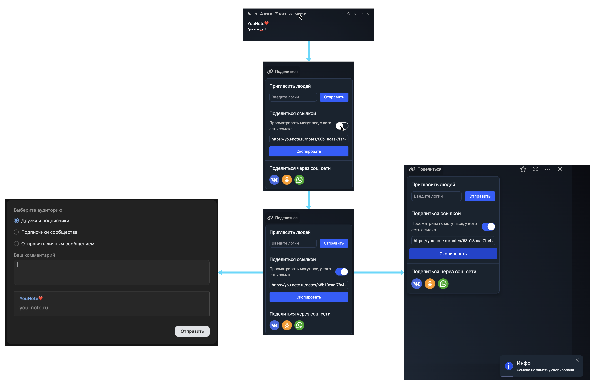
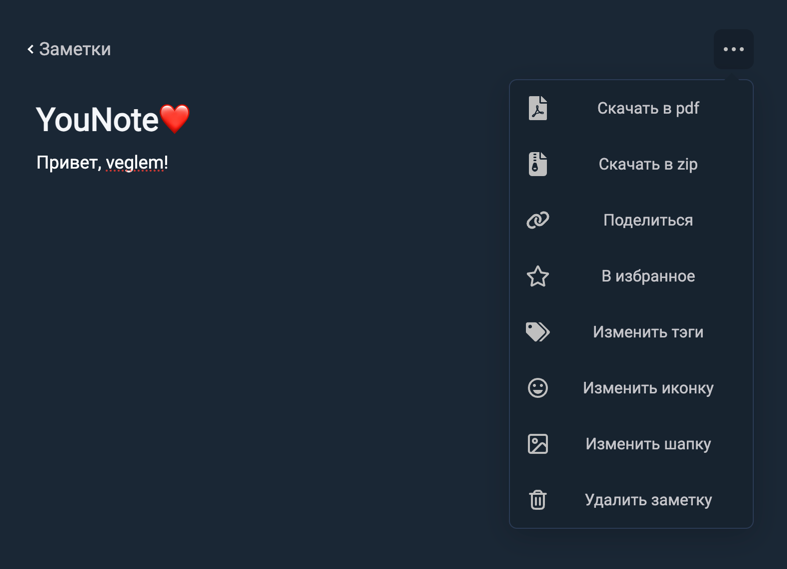
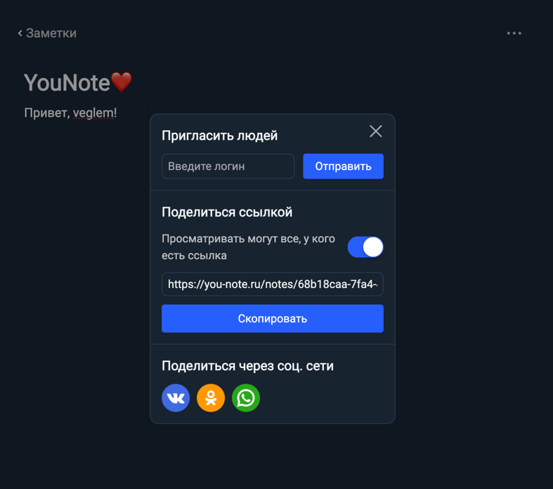
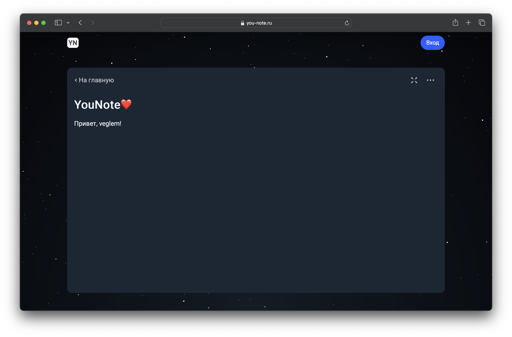

# Шеринг заметки

Браузер: Arc - Версия 1.61.2 (54148)
Chromium Engine Version 129.0.6668.71
___
# Владелец заметки
## Функционал

* Возможность включить доступ к заметке 
* Возможность скопировать ссылку
* Возможность отправить ссылку через соцсети

### Включение/Выключение шеринга

Включение/Выключение шеринга происходит по нажатию на switch box

С включеным switch box заметка становится доступной любому (не авторизованному пользователю в том числе)

Если switch box выклчен, то заметка доступна только ее автору.

### Копирование ссылки

При нажатии на кнопку "Скопировать" ссылка на заметку попадает в буфер обмена

### Поделиться в соцсетях

* При нажатии на логотип "VK"
  * Открывается окно через которое можно поделиться заметкой в вк
* При нажатии на логотип "Одноклассники"
  * Открывается окно через которое можно поделиться заметкой в одноклассниках
* При нажатии на логотип "WhatsApp"
  * Открывается окно через которое можно поделиться заметкой в WhatsApp

## Верстка

При ограниченном размере экрана кнопка шеринга скрывается в меню заметки, а само окно шеринга превращается в popup виджет

# Сторонний пользователь
## Функционал

* Возможность просматривать заметку

## Верстка 

Заметка открывается в полноэкранном режиме