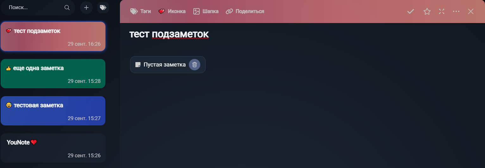
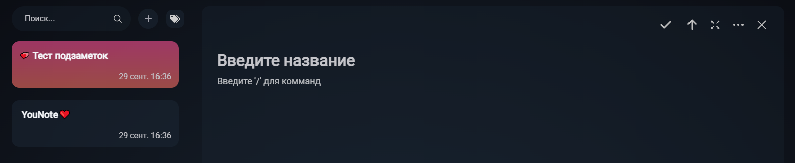
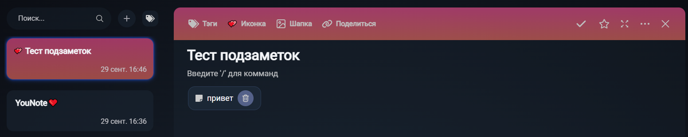
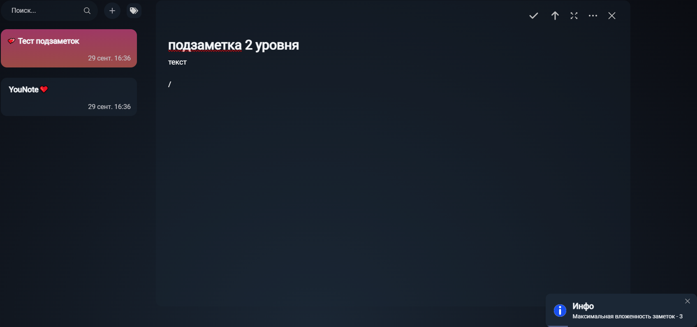
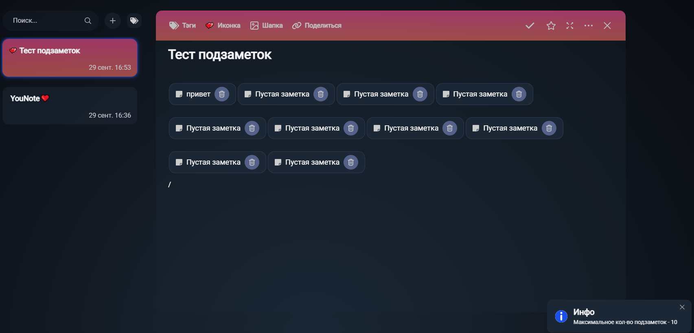

# Подзаметки

1. Открыть заметку, написать "/" (без кавычек), в выпадающем меню нажать "подзаметка". В заметке должна появиться подзаметка.

2. Нажать кнопку корзины на подзаметке. Подзаметка должна исчезнуть (удалиться) из заметки.

3. Нажать на подзаметку. Должен произойти переход в подзаметку - она должна открыться в редакторе. В тулбаре редактора не должно быть кнопок шаринга и добавления в избранное заметки, но должна появиться стрелка - кнопка перехода в родительскую заметку.

4. Нажать в тулбаре на стрелку вверх. В редакторе должна открыться родительская заметка.

5. Зайти в подзаметку, дать ей название, написать любой текст. Вернуться в родительскую заметку, убедиться что в иконке подзаметки отображается ее название. Зайти в подзаметку, убедиться, что сохранился текст.

6. Проделать шаги 1-5 еще раз, но уже внутри подзаметки. Убедиться, что нет отклонений от описания.

7. В созднной шаге 6 подзаметке (подзаметке 2 уровня, которая имеет родительскую заметку, которая в свою очередь тоже имеет родительскую заметку) попытаться создать подзаметку (3 уровня). Должно появиться следующее всплывающее уведомление:

8. Вернуться в корневую заметку, создать в ней еще 9 подзаметок, чтобы в сумме их было 10. Попытаться создать 11-ю подзаметку. Должно появиться следующее всплывающее уведомление:

9. Поделиться корневой заметкой по username с другим аккаунтом. Зайти с того аккаунта и убедиться, что отображаются все созданные подзаметки всех уровней вложенности, а также что в них отображаются верные названия и содержимое.

10. Сделать корневую заметку публичной, скопировать ссылку на нее, открыть ссылку в режиме инкогнито браузера. Убедиться, что отображаются все созданные подзаметки всех уровней вложенности, а также что в них отображаются верные названия и содержимое.

11. Удалить первую подзаметку, которая содержит подзаметки. Подзаметка должно пропасть из редактора (удалиться).

12. Удалить корневую заметку. Заметка должна успешно удалиться (пропасть из списка).
