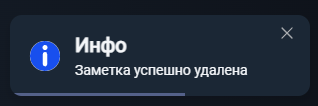

# Подзаметки

**Браузер** - _Google Chrome Version 128.0.6613.138_

**Мобильная версия** - _Google Chrome Version 15.5.58.28.arm64_

### Описание подзаметки
Визуально подзаметка отличается от обычной (родительской заметки) следующим:
- Не отображается в списке заметок
- Нет иконки "Тэги", то есть невозможно назначить тэг
- Нет иконки "Иконка", то есть невозможно назначить подзаметке иконку
- Нет иконки "Шапка", то есть невозможно назначить подзаметке шапку
- Нет иконки "Поделиться", то есть невозможно поделиться заметкой
- Нет иконки звездочки, то есть невозможно добавить в избранное
- Появляется иконка-стрелка для навигации (перехода в родительскую заметку)

1. Подзаметка 1-го уровня:
- Открыть заметку, написать "/" (без кавычек), в выпадающем меню нажать "подзаметка". В заметке должна появиться подзаметка.

- Нажать кнопку корзины на подзаметке. Подзаметка исчезает (удаляется) из заметки. При этом в правом нижнем углу экрана появляется такой попап:

- Нажать на подзаметку. Должен произойти переход в подзаметку - она должна открыться в редакторе. 
В тулбаре редактора не должно быть кнопок шаринга и добавления в избранное заметки, но должна появиться стрелка - кнопка перехода в родительскую заметку.

- Нажать в тулбаре на стрелку вверх. В редакторе должна открыться родительская заметка.

- Зайти в подзаметку, дать ей название, написать любой текст. Вернуться в родительскую заметку, убедиться что в иконке подзаметки отображается ее название. Зайти в подзаметку, убедиться, что сохранился текст.

2. Подзаметка 2-го уровня:
- Открыть заметку, написать "/" (без кавычек), в выпадающем меню нажать "подзаметка". В заметке должна появиться подзаметка.
Перейти в созданную подзаметку 1-го уровня, кликнув на нее. В открывшемся окне редактора написать "/" (без кавычек), в выпадающем меню нажать "подзаметка" - внутри подзаметки 1-го уровня появится подзаметка 2-го уровня.

- Нажать кнопку корзины на подзаметке 2-го уровня. Подзаметка 2-го уровня исчезает (удаляется) из подзаметки 1-го уровня. При этом в правом нижнем углу экрана появляется тост с информацией "Заметка успешно удалена".

- Нажать на подзаметку 2-го уровня. Должен произойти переход в нее - она должна открыться в редакторе.
   В тулбаре редактора не должно быть кнопок шаринга и добавления в избранное заметки, но должна появиться стрелка - кнопка перехода в родительскую заметку (в данном случае родительской заметкой будет являться подзаметка 1-го уровня).

- Нажать в тулбаре на стрелку вверх. В редакторе должна открыться родительская заметка (в данном случае родительской заметкой будет являться подзаметка 1-го уровня).

- Зайти в подзаметку 2-го уровня, дать ей название, написать любой текст. Вернуться в родительскую заметку (подзаметку 1-го уровня), убедиться что в иконке подзаметки отображается ее название. Зайти в подзаметку 2-го уровня, убедиться, что сохранился текст.

3. Подзаметка 3-го уровня:
- Создать новую заметку, написать в ней "/" (без кавычек), в выпадающем меню нажать "подзаметка" - внутри заметки появится подзаметка.
- Перейти в созданную подзаметку 1-го уровня, кликнув на нее. В открывшемся окне редактора написать "/" (без кавычек), в выпадающем меню нажать "подзаметка" - внутри подзаметки 1-го уровня появится подзаметка 2-го уровня.
- Перейти в созданню подзаметку 2-го уровня, кликнув на нее.В открывшемся окне редактора написать "/" (без кавычек), в выпадающем меню нажать "подзаметка" (пытаемся создать подзаметку 3-го уровня). Должно появиться следующее всплывающее уведомление:

4. Открыть корневую заметку, создать в ней 10 подзаметок. Попытаться создать 11-ю подзаметку. Должно появиться следующее всплывающее уведомление:

5. Поделиться корневой заметкой по username с другим аккаунтом. Зайти с того аккаунта и убедиться, что отображаются все созданные подзаметки всех уровней вложенности, а также что в них отображаются верные названия и содержимое.
6. Сделать корневую заметку публичной, скопировать ссылку на нее, открыть ссылку в режиме инкогнито браузера. Убедиться, что отображаются все созданные подзаметки всех уровней вложенности, а также что в них отображаются верные названия и содержимое.
7. Удалить первую подзаметку, которая содержит подзаметки. Подзаметка должно пропасть из редактора (удалиться).
8. Удалить корневую заметку. Заметка должна успешно удалиться (пропасть из списка).
