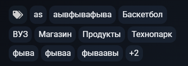
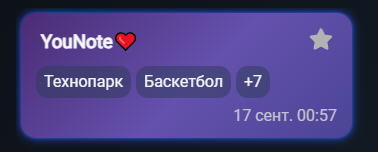
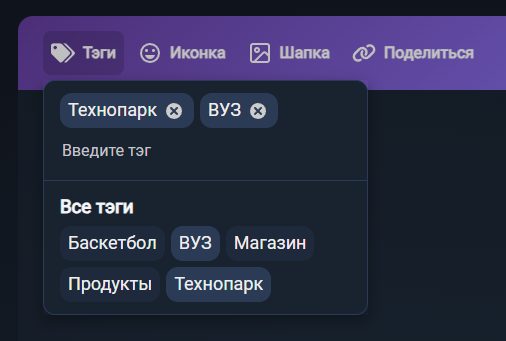
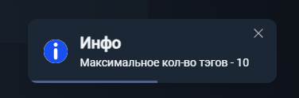

# Тэги

## Главная

### Функционал

* При клике по тэгу правой мышкой открывается выпадающее меню редактирования тэга:
    * При выборе пункта "Изменить" открывается модальное окно, содержащее:
      * Название: "Форма изменения тэга"
      * Инпут для ввода нового названия тэга
        * При вводе названия уже существующего текста под инпутом отобразиться ошибка "Такой тэг уже существует"
        * При вводе 13 символов и более под инпутом отобразиться ошибка "Такой слишком длинный"
        * При вводе двух символов и менее под инпутом отобразиться ошибка "Такой слишком короткий"
      * Кнопку "Сохранить"
        * При нажатии, в случае когда уже существует тэг с введеным названием
          * Под инпутом отобразиться ошибка "Такой тэг уже существует"
          * Название тэга не обновляется
          * Модальное окно не закрывается
        * При нажатии, в случае когда введенное название уникально
          * Название тэга обновляется (в списке тэгов и у заметок)
          * Модальное окно закрывается
      * Кнопку-крестик
        * При нажатии
          * Модальное окно закрывается
          * Введенное название тэга в инпуте сохраняется
    * При выборе пункта "Удалить" открывается модальное окно для подтверждения удаления тэга
      * Название: "Форма удаления тэга"
      * Описание: "Тэг будет удален без возможности восстановления"
      * Кнопку "Отменить"
        * При нажатии
          * Тэг не удялется
          * Модальное окно закрывается
      * Кнопку "Удалить"
        * При нажатии
          * Тэг удаляется из списка и из всех заметок
          * Модальное окно закрывается
      * Кнопку-крестик
        * При нажатии 
          * Модальное окно закрывается
          * Тэг не удаляется

### Верстка

* Список тэгов адаптируются под размер экрана
* Список тэгов обрезается при большом количестве тэгов

* В случае большое количества тэгов у заметки (три и более)
  * Отображаются только первые два
  * Остальные прячутся под каунтер

## Редактор

### Функционал

* При нажатии на кнопку "Тэги" в тулбаре редактора заметки открывается панель управления тэгами

* Тэг из заметки можно удалить тремя способами
  * Нажав на крестик в верхнем списке
  * Нажав на активный тэг в нижнем списке
  * Выделив поле ввода тэга и дважды нажав Backspace
* Максимальная длина тэга - 12 символов
  * В случае попытки добавления тэга с длинной больше 12 символов появляется снэкбар с ошибкой
* Минимальная длина тэга - 2 символов
    * В случае попытки добавления тэга с длинной менее 2 символов появляется снэкбар с ошибкой

* Добавить тэг к заметке можно двумя способами
  * Ввести название нового тэга в поле "Введите тэг" и нажать Enter
    * Если ввести имя уже существующего тэга, то появляется снэкбар с ошибкой
  * Нажать на любой из неактивных тэгов из нижнего списка

* Заметка может иметь максимум 10 тэгов
  * При попытке добавить 11 тэг появляется снэкбар с предупреждением

### Верстка

* Панель тэгов адаптируются под размер экрана
