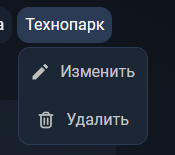

# Тэги

## Главная

### Функционал

* Есть возможность фильтровать заметки по тэгам (одному и более)
* При клике по тэгу правой мышкой открывается выпадающее меню редактирования тэга:
    * При выборе пункта "Изменить" открывается модальное окно с формой для обновления названия у тэга
    * При выборе пункта "Удалить" открывается модальное окно для подтверждения удаления тэга

### Верстка

* Список тэгов адаптируются под размер экрана
* Список тэгов обрезается при большом количестве тэгов

* В случае большое количества тэгов у заметки - отображаются только первые 2-3 тэга, остальные прячутся под каунтер

## Редактор

### Функционал

* При нажатии на кнопку "Тэги" в тулбаре редактора заметки открывается панель управления тэгами

* Тэг можно удалить тремя способами
  * Нажав на крестик в верхнем списке
  * Нажав на активный тэг в нижнем списке
  * Выделив поле ввода тэга и дважды нажав Backspace
* Максимальная длина тэга - 12 символов
  * В случае попытки добавления тэга с длинной больше 12 символов появляется снэкбар с ошибкой
* Минимальная длина тэга - 2 символов
    * В случае попытки добавления тэга с длинной менее 2 символов появляется снэкбар с ошибкой

* Чтобы добавить тэг к заметке можно
  * Ввести название нового тэга в поле "Введите тэг" и нажать Enter
    * Если ввести имя уже существующего тэга, то появляется снэкбар с ошибкой
  * Нажать на любой из неактивных тэгов из нижнего списка

* Заметка может иметь максимум 10 тэгов
  * При попытке добавить 11 тэг появляется снэкбар с предупреждением

### Верстка

* Панель тэгов адаптируются под размер экрана
